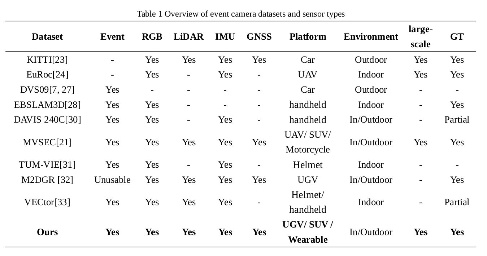
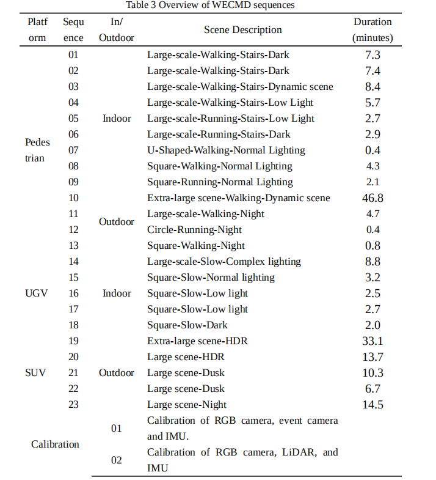
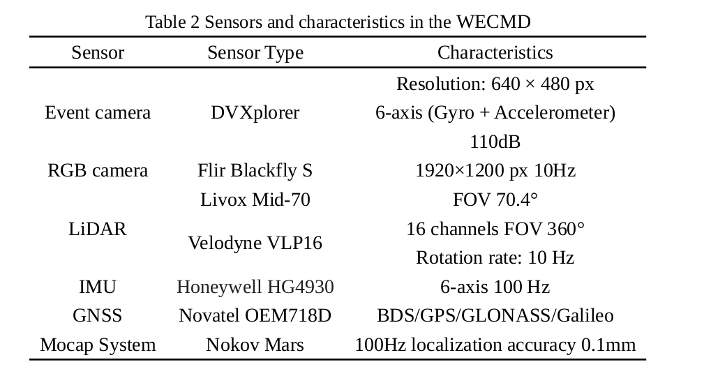
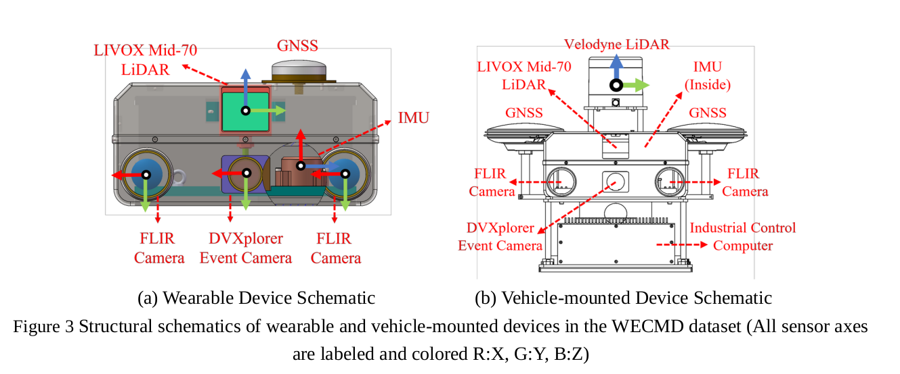

<!--
 * @Author: guoxl
 * @Date: 2024-10-20 19:51:26
 * @Email: guoxueli@whu.edu.cn 
 * @LastEditors:  
 * @LastEditTime: 2025-03-09 22:04:19
 * @Description: 
 * @version:  
-->
# WECMD: A Multisensor Dataset for Wearable Event Cameras in the Age of Embodied Intelligence

In the context of the embodied intelligence era, pedestrian-wearable datasets effectively simulate scenarios that pose challenges for humanoid robots to navigate. However, there is still a significant lack of publicly available multi-sensor datasets specifically addressing the urgent and widespread localization needs of pedestrians. The unique dynamics of pedestrian movement further dictate that traditional RGB cameras and light detection and ranging (LiDAR) sensors are often inadequate for capturing their motion characteristics. Thus, given the high dynamic range, low latency, and immunity to motion blur that event cameras provide, there is an urgent need for datasets based on event cameras. To meet the need for multisensory data from wearable sensors, we have collected a comprehensive pedestrian-wearable dataset focused on large-scale indoor and outdoor environments with diverse motion dynamics and lighting conditions, primarily using an event camera. The dataset includes recordings from an event camera, two industrial RGB cameras, a solid-state LiDAR, a mechanical LiDAR, an inertial measurement unit (IMU), and a global navigation satellite system (GNSS) receiver. Each sensor underwent rigorous calibration to ensure accurate data collection. In indoor scenarios, ground truth was provided by a motion capture system, while in outdoor environments, the reference ground truth was obtained using high-precision GNSS+INS integrated post-processing software. Moreover, to accommodate other research teams interested in event cameras beyond wearable applications. This dataset also includes multisource fusion data collected from event cameras mounted on Sport Utility Vehicles (SUVs) and Unmanned Ground Vehicles (UGVs). The dataset is structured into 22 subsets, categorized by varying degrees of difficulty based on dynamic motion, lighting conditions, and scene texture complexity. This dataset represents the first large-scale, pedestrian-wearable event camera dataset, filling a critical gap in event-based vision research for pedestrian movement across diverse environments. We evaluated the dataset using state-of-the-art visual simultaneous localization and mapping (SLAM), LiDAR SLAM, event-based SLAM, and GNSS algorithms. Results indicate that existing SLAM and GNSS algorithms face significant challenges in several scenarios within this dataset, highlighting its benchmark use for future research in multi-sensor fusion and robust SLAM algorithm development. For the benefit of the research community, we have made the dataset and accompanying tools publicly available.

# Overview of event camera datasets and sensor types

# Sensor Types in the WECMD Dataset

# Download link🔗

## Baidu Netdisk：

https://pan.baidu.com/s/1qhGqweNSSlBixCNeexcsqw
code：ivw8

## Google Drive

comming soon...

## Onedrive

comming soon...
